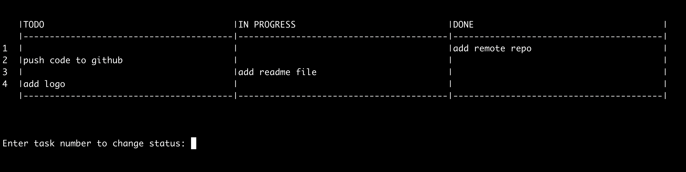

# sprintty - terminal sprint

sprin**tty** -  Display a Scrum sprint board in terminal

## Features

- native in terminal
- no external dependencies (the project uses only standard system tools)
- compatible with Linux/macOS terminal

## Getting started

1. Clone this repo to your machine
2. `cd` into the cloned directory
3. Add execute permissions to the shell script: `sudo chmod +x sprintty.sh`
4. Create a file named `backlog` (no file extension after the filename)
5. Add some tasks to the `backlog` file, each task in a separate line
6. Run `./sprintty.sh`

